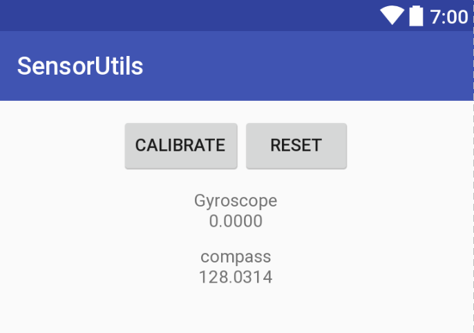

Get the relative horizontal rotation angle with gyroscope reading

### 使用方法
- dependencies 里添加
``` gradle
compile 'sysu.mobile.limk:sensorutils:0.2'
```

- 获取一个SensorUtils实例
``` java
mSensorUtils = SensorUtils.getInstance(context);
```

- 跳转到CalibrationActivity进行陀螺仪校准
``` java
Intent intent = new Intent(MainActivity.this, CalibrationActivity.class);
startActivity(intent);
```
校准的原理是静止放置手机统计出陀螺仪的线性漂移，以便在测试过程中减去线性漂移来减少累积误差

- 初始化SensorUtils并注册传感器（通常在onResume中）
``` java
void onResume() {
    super.onResume();
    // 注册传感器
    mSensorUtils.registerSensor();
    // 初始化参数
    mSensorUtils.reset();
}
```
- 取消注册传感器（通常在onPause中）
``` java
protected void onPause() {
    super.onPause();
    mSensorUtils.unregisterSensor();
}
```

- 获取从reset时刻开始的相对旋转角度
``` java
mSensorUtils.getAngle()
```

- 获取当前时刻罗盘读数
``` java
mSensorUtils.getCompassDirection()
```

- Samples运行截图


